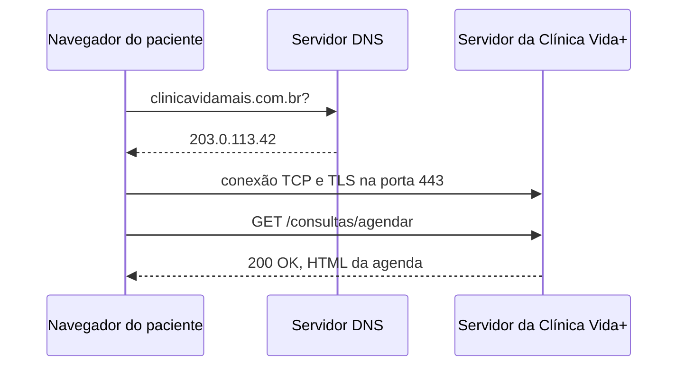

# Arquitetura da requisição — Clínica Vida+

## O caminho de uma requisição



## Evidência do DNS

Domínios investigados: `github.com` e `uninove.br`

```
C:\Users\julia>nslookup github.com 8.8.8.8
Servidor:  dns.google
Address:  8.8.8.8

Não é resposta autoritativa:
Nome:    github.com
Address:  4.228.31.150

C:\Users\julia>nslookup uninove.br 8.8.8.8
Servidor:  dns.google
Address:  8.8.8.8

Não é resposta autoritativa:
Nome:    uninove.br
Address:  167.99.0.217

C:\Users\julia>ping github.com

Disparando github.com [4.228.31.150] com 32 bytes de dados:
Resposta de 4.228.31.150: bytes=32 tempo=7ms TTL=107
Resposta de 4.228.31.150: bytes=32 tempo=7ms TTL=107
Resposta de 4.228.31.150: bytes=32 tempo=7ms TTL=107
Resposta de 4.228.31.150: bytes=32 tempo=8ms TTL=107

Estatísticas do Ping para 4.228.31.150:
    Pacotes: Enviados = 4, Recebidos = 4, Perdidos = 0 (0% de perda),
Aproximar um número redondo de vezes em milissegundos:
    Mínimo = 7ms, Máximo = 8ms, Média = 7ms
```

**Observação:** o servidor DNS padrão da minha rede (IPv6, endereço `2804:71d4::254`)
não respondeu (`DNS request timed out`). Precisei consultar diretamente o servidor
público do Google (`8.8.8.8`, dns.google) para obter resposta. O IP devolvido pelo
`nslookup` (`4.228.31.150`) bate exatamente com o IP que o `ping` usou para se
comunicar com o servidor, confirmando que a tradução de nome para IP feita pelo
DNS foi usada corretamente na conexão.

## Evidência do HTTP

Requisições capturadas na aba Network do DevTools, ao acessar `github.com`:

| Método | Recurso                          | Status | Tipo     |
| ------ | --------------------------------- | ------ | -------- |
| GET    | github.com                        | 302    | document |
| GET    | github.com/?locale=pt-br          | 200    | document |
| GET    | react-e27d1b3e03961e68.js         | 200    | script   |
| GET    | MonaSansVF-wdth-wght-opsz...       | 200    | font     |

O status **302** na primeira linha é um redirecionamento: o servidor informa que
o conteúdo está em outro endereço (`location: https://github.com/?locale=pt-br`,
a versão em português), e o navegador refaz a requisição automaticamente para lá.

**Headers da requisição principal (`GET /`):**

```
Requisição:
:authority (equivalente ao Host): github.com
accept-language: pt-BR,pt;q=0.9,en-US;q=0.8,en;q=0.7
user-agent: Mozilla/5.0 (Windows NT 10.0; Win64; x64) AppleWebKit/537.36
            (KHTML, like Gecko) Chrome/152.0.0.0 Safari/537.36

Resposta:
Status: 302 Found
content-type: text/html; charset=utf-8
location: https://github.com/?locale=pt-br
server: github.com
```

**Teste de página inexistente:** acessando `github.com/pagina.que.nao.existe`,
o servidor retornou status **404 Not Found**, confirmando o tratamento de erro
para recursos que não existem no servidor.

## Por que o HTTPS importa

O formulário de agendamento da Clínica Vida+ carrega dados pessoais sensíveis do
paciente, como CPF, telefone e data de nascimento. Se essa comunicação acontecesse
por HTTP simples (porta 80), esses dados trafegariam em texto puro pela rede —
qualquer pessoa conectada ao mesmo wi-fi da sala de espera, por exemplo, poderia
capturar e ler essas informações. O HTTPS resolve isso encapsulando o HTTP dentro
de um túnel TLS, que criptografa todo o conteúdo da conversa entre o navegador do
paciente e o servidor. Além do sigilo, o TLS garante que os dados não sejam
alterados no caminho e, por meio do certificado digital, comprova que o servidor
que está respondendo é realmente o da Clínica Vida+, e não um impostor
interceptando a conexão.
